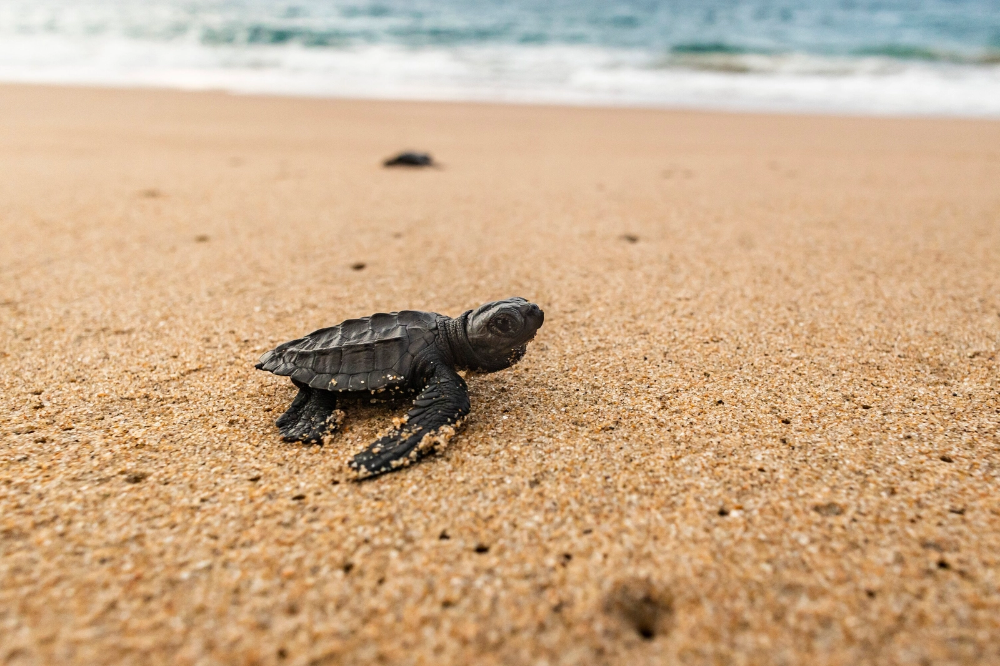
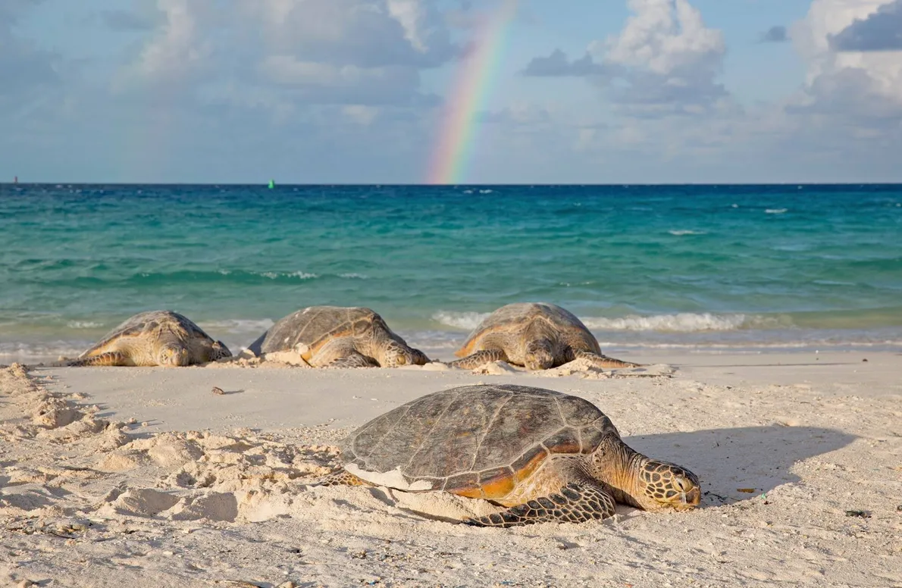
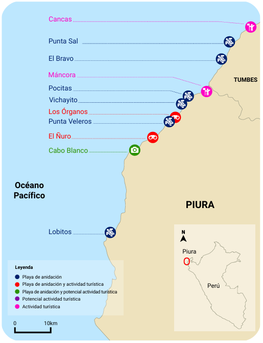

# 🌊 ODS 14: Vida Submarina

  

<strong>FIGURA 1</strong> 
Conservar y utilizar en forma sostenible los océanos, los mares y los recursos marinos. Fundación Aquae.

## 🎯 Meta 14.2

> "Gestionar y proteger sosteniblemente los ecosistemas marinos y costeros para evitar efectos adversos importantes, incluso fortaleciendo su resiliencia, y adoptar medidas para restaurarlos a fin de restablecer la salud y la productividad de los océanos.”

📌 Aunque esta meta tenía como plazo inicial el año 2020, continúa siendo una prioridad activa para los países, ya que la mayoría de sus objetivos no se han alcanzado por completo. En este contexto, cualquier esfuerzo por monitorear, proteger y restaurar ecosistemas costeros vulnerables —como las playas de anidación de tortugas marinas— contribuye directamente a su cumplimiento sostenido.

---

## 👤 USUARIO

Voluntarios de conservación o técnicos locales que necesitan detectar de forma oportuna la eclosión de crías de tortugas marinas en playas del norte del Perú, para intervenir rápidamente y aumentar su tasa de supervivencia.

### Problemática:

Alta mortalidad de crías de tortuga marina en las playas del norte del Perú debido a la falta de sistemas que permitan detectar oportunamente la eclosión de los nidos. La ausencia de monitoreo automatizado impide a los voluntarios y técnicos intervenir a tiempo para proteger a las crías de amenazas como la desorientación por luz artificial, depredadores naturales o interferencias humanas, comprometiendo así la eficacia de los esfuerzos de conservación y la recuperación de poblaciones en peligro de extinción.

---

## I) INTRODUCCIÓN

Las tortugas marinas son reptiles migratorios que se distribuyen por todos los océanos del planeta. A lo largo de su ciclo de vida, utilizan distintas regiones según sus necesidades biológicas: eligen los mares tropicales para reproducirse, se resguardan en zonas oceánicas durante sus primeras etapas y se alimentan en áreas de clima templado. Aunque pasan toda su vida en el agua, las hembras emergen ocasionalmente a tierra firme durante la época de reproducción para desovar, cumpliendo así con una parte esencial de su complejo ciclo vital. (1) Sin embargo, este ciclo se encuentra cada vez más amenazado por factores ambientales y antrópicos. La pérdida de áreas de anidación, provocada por la urbanización costera, la erosión y el aumento del nivel del mar, compromete seriamente sus oportunidades reproductivas. A ello se suma el impacto del cambio climático, que modifica los hábitats clave mediante el incremento de las temperaturas. Estos factores no solo dificultan el proceso de anidación, sino que también reducen la viabilidad de los huevos y la supervivencia de las crías, poniendo en riesgo la continuidad de sus poblaciones. (2) 
La mayoría de las especies de tortugas marinas enfrentan un alto riesgo de extinción, ya que seis de las siete especies están clasificadas por la Lista Roja de la UICN (Unión Internacional para la Conservación de la Naturaleza) como “En Peligro Crítico”, “En Peligro” o “Vulnerables”. Entre las principales amenazas se encuentran la captura directa o accidental por actividades pesqueras, la recolección ilegal de huevos y la degradación de sus hábitats de alimentación y anidación. Esta última se ha visto especialmente afectada por el crecimiento del desarrollo urbano costero, la extracción de arena, y el aumento de la contaminación lumínica en las playas.

El uso intensivo de las zonas costeras para el turismo ha llevado a la construcción de hoteles, restaurantes y viviendas cerca de playas de anidación, lo que ha alterado la estructura natural del ecosistema. En particular, la luz artificial ha demostrado afectar negativamente tanto la anidación de las hembras como la orientación de las crías. Estudios han demostrado que las tortugas evitan anidar en playas iluminadas y que las crías tienden a desorientarse, alejándose del mar al seguir fuentes de luz artificial. Este fenómeno ha sido documentado en diversas regiones, incluyendo playas en Florida, Costa Rica y Gabón, donde se ha observado una marcada reducción en los intentos de anidación y un aumento en la desorientación de neonatos debido al alumbrado urbano.(3)

  

<strong>FIGURA 2</strong> 
Una tortuga intenta llegar al mar en la playa Teopa, Careyes. Solo una de cada mil llegará a edad adulta para desovar en el mismo sitio donde nació. Fotografía de Ricardo Azarcoya. Fuente: National Geographic.

Por otro lado, el turismo costero forma parte de la Economía Azul y ha generado importantes beneficios económicos mediante actividades como el avistamiento de fauna marina. Este tipo de ecoturismo, especialmente enfocado en especies como las tortugas marinas verdes, no solo impulsa economías locales, sino que también apoya la conservación. Sin embargo, la supervivencia de estas tortugas están amenazadas por factores ambientales y humanos. Por ello, las Áreas Marinas Protegidas y la participación de las comunidades locales resultan esenciales para su protección. Además, el contenido generado por turistas en redes sociales se ha convertido en una herramienta útil para el monitoreo y la concientización ambiental. En este contexto, la inteligencia artificial (IA) ofrece nuevas oportunidades para fortalecer la gestión y conservación de especies marinas. Modelos de aprendizaje profundo pueden entrenarse para detectar tortugas en su entorno natural, facilitando tanto el monitoreo ecológico como la experiencia de los visitantes. Sin embargo, este desarrollo requiere bases de datos visuales amplias y variadas, cuya recopilación representa un gran desafío. En lugares como la isla Liuqiu en Taiwán, donde el turismo ha reemplazado a la pesca como principal fuente de ingresos, se busca aplicar la IA para equilibrar el turismo responsable y la conservación, evitando el acoso a la fauna y promoviendo prácticas sostenibles.(4)

Como parte de estos avances tecnológicos en conservación, un estudio reciente implementó el uso de drones y modelos de inteligencia artificial basado en YOLOv7 para contar automáticamente tortugas marinas verdes (Chelonia mydas) en zonas costeras de Japón usando imágenes captadas por drones. El sistema logró rastrear y contar con éxito a las tortugas en la superficie del mar, aunque tuvo menor precisión con individuos submarinos debido a la complejidad del entorno. A pesar de ello, el conteo automatizado mostró buenos resultados y representa un avance significativo para mejorar la eficiencia de los programas de monitoreo y conservación de esta especie.(5)

  

<strong>FIGURA 3</strong> 
Implementación de la IA para la conservación de las tortugas marinas.

---

## II) CONTEXTO SOCIAL

### A NIVEL MUNDIAL

Las tortugas marinas, consideradas especies fundamentales para el equilibrio de los ecosistemas marinos y costeros, están actualmente en peligro de extinción debido a la influencia combinada del cambio climático y las actividades humanas. Además de estos factores, investigaciones recientes han identificado que fenómenos naturales como los monzones también afectan su comportamiento reproductivo. Los monzones son vientos estacionales que cambian de dirección según la época del año, alterando las condiciones climáticas locales, como la humedad, la presión atmosférica y las mareas.
En islas del Mar de China Meridional, por ejemplo, se ha observado que las tortugas verdes (Chelonia mydas) modifican sus rutas de anidación según estos cambios de viento. Durante el monzón de verano, sus trayectos hacia las playas se vuelven más erráticos, y la tasa de anidación exitosa depende de factores como la presión atmosférica y la altura de la marea.(6)
Otro ejemplo es la costa de Odisha, India, que es uno de los lugares más importantes del mundo para la anidación masiva de tortugas golfinas (Lepidochelys olivacea), un fenómeno conocido como arribada. En este evento, cientos de miles de hembras llegan al mismo tiempo a la playa para poner sus huevos. Sin embargo, esta región enfrenta varios problemas ambientales como la erosión costera debido al aumento del nivel del mar y marejadas ciclónicas inducidas por ciclones. (3) Aunque las tortugas marinas son especies migratorias, las hembras muestran fidelidad natal, regresando repetidamente a la misma playa donde nacieron para desovar. Esto las hace vulnerables a cualquier cambio en esa zona. Tras el proceso de anidación, las hembras dejan huellas anchas y profundas en la arena, lo que permite a los investigadores identificar su presencia. No obstante, no todas las emergencias resultan en un nido: si la tortuga es perturbada antes de la oviposición, puede abandonar el intento sin dejar huevos, dificultando la estimación precisa de nidos reales. (7)
Múltiples estudios han evidenciado que las tormentas ciclónicas severas tienen efectos devastadores en las zonas de anidación de estas tortugas. No solo aceleran la erosión de las playas, sino que también destruyen huevos y nidos, y desplazan a las tortugas adultas, afectando su capacidad para encontrar sitios adecuados de anidación. En el caso de la tortuga golfina —particularmente vulnerable por su sincronía reproductiva— estas perturbaciones pueden provocar una drástica disminución en el número de hembras anidadoras, reduciendo el éxito reproductivo de toda la población. Con el aumento de la frecuencia e intensidad de estos eventos debido al cambio climático, el impacto sobre las arribadas será cada vez mayor, amenazando la estabilidad poblacional de la especie a largo plazo.(8)

Asimismo, diversos estudios han demostrado que todas las etapas del ciclo de vida de las tortugas marinas se ven afectadas por el cambio climático. Uno de los efectos más conocidos es la feminización de las crías, producto del incremento de la temperatura de la arena durante la incubación. Este desequilibrio en la proporción de sexos compromete la estabilidad reproductiva de las poblaciones. Las temperaturas más frías tienden a producir machos, mientras que las más cálidas favorecen a las hembras. Existe un rango de transición térmica y una temperatura pivotal que define el sexo de la camada, lo que hace que las tortugas marinas sean extremadamente vulnerables al calentamiento global. (9)
Estos hallazgos resaltan que, para proteger a las tortugas marinas de manera efectiva, es necesario considerar tanto las acciones humanas como las condiciones ambientales naturales que afectan sus ciclos reproductivos.

  

<strong>FIGURA 4</strong> 
La tortuga verde (<em>Chelonia mydas</em>) es la mayor de las tortugas marinas de caparazón duro. Anida en más de 80 países y vive en las zonas costeras de más de 140 países, de acuerdo con el Servicio Nacional de Pesquerías Marinas de Estados Unidos. Fotografía de Dan Clark USFWS. 
<strong>Fuente:</strong> National Geographic.

---
### A NIVEL NACIONAL

En el Perú, la anidación de tortugas marinas enfrenta crecientes amenazas debido al mal manejo del turismo en zonas costeras del norte del país. En regiones como Piura y Tumbes, donde se ha identificado recientemente la presencia de nidos de tortuga verde y tortuga golfina, prácticas inadecuadas por parte de los visitantes ponen en riesgo los procesos reproductivos de estas especies. Acciones como el uso de flashes fotográficos, la presencia excesiva de personas, el contacto directo con nidos o tortugas adultas, y la iluminación artificial durante la noche, pueden provocar que las hembras abandonen el proceso de anidación o que las crías se desorienten y no logren llegar al mar.
Estas actividades, lejos de ser controladas, muchas veces ocurren sin supervisión ni conocimiento por parte de los turistas, lo que agrava el impacto sobre poblaciones que ya se encuentran en riesgo de extinción. A pesar de que en el país los eventos de anidación son poco frecuentes —con un promedio de apenas 25 a 30 nidos anuales— la presión humana representa un peligro considerable para su éxito reproductivo. La falta de regulación y sensibilización turística frente a este fenómeno evidencia la necesidad urgente de fortalecer la gestión ambiental en estas zonas, especialmente si se desea compatibilizar la conservación de estas especies con el desarrollo turístico.(10)
Por otro lado, El Plan Nacional para la Conservación de las Tortugas Marinas (MINAM, 2019) identificó como otro factor el cambio climático , ya que este puede tener efectos significativos sobre el éxito reproductivo de estas especies, al alterar variables como la estabilidad de las playas y la temperatura de incubación. Según el documento, influyen directamente en la viabilidad de los embriones y en la proporción de sexos en las crías. No obstante, también se señala que en el país no se cuenta con información precisa sobre los efectos reales del cambio climático en las poblaciones locales de tortugas marinas, y que existe la necesidad urgente de realizar investigaciones específicas para comprender estos impactos y diseñar medidas de mitigación adecuadas

  

<strong>FIGURA 5</strong> 
Ciclo de vida generalizado de las tortugas marinas.

---
## III) CONTEXTO ECONÓMICO
En el Perú, organismos oficiales como la Dirección Regional de Comercio Exterior y Turismo (DIRCETUR) han reconocido que las tortugas marinas constituyen un recurso natural estratégico, con un alto potencial para promover el turismo sostenible. Según DIRCETUR (2019), la observación de especies marino-costeras —como las tortugas— no solo representa una fuente importante de ingresos económicos en diversas zonas del mundo, sino que también funciona como una herramienta eficaz para la educación ambiental, la mejora socioeconómica de las comunidades costeras y el impulso a la investigación científica de la biodiversidad marina. (1)
En las regiones de Piura y Tumbes, ubicadas en el norte del Perú, se ha desarrollado en los últimos años una creciente actividad turística vinculada a las tortugas marinas, especialmente en zonas como El Ñuro, Los Órganos, Máncora y Cancas. En estos lugares, visitantes nacionales y extranjeros participan en actividades de observación y nado con tortugas verdes (Chelonia mydas), generando ingresos locales y dinamizando la economía regional. Desde aproximadamente el año 2014, se ha registrado un aumento sostenido en el número de turistas que llegan para interactuar con estas especies, a pesar de la falta de regulación en dichas prácticas. Esta situación resalta tanto el potencial económico de las tortugas marinas, como la urgencia de implementar medidas de monitoreo y conservación que aseguren la sostenibilidad de este recurso natural. (11)

  

<strong>FIGURA 6</strong> 
Playas de anidación y ubicación de las actividades turísticas vinculadas a las tortugas marinas en el litoral norte del Perú. 
<em>Fuente: Manual de buenas prácticas de gestión de servicio turístico para la actividad de observación de tortugas marinas en el litoral del Perú, 2023.</em>

Un ejemplo concreto de este impacto económico se evidenció en agosto de 2024, cuando cerca de 5,000 turistas ecuatorianos visitaron Tumbes durante un fin de semana largo, generando aproximadamente US$ 1.5 millones en ingresos para la región. Esta situación resalta tanto el potencial económico de las tortugas marinas como la urgencia de implementar medidas de monitoreo y conservación que aseguren la sostenibilidad de este recurso natural.

---

## IV) MAPA DE EMPATÍA

mapa_empatia.png)

---

## V) MAPA DE VIAJE

journey_map.png)

---

## VI) DIAGRAMA DE ISHIKAWA

diagrama_ishikawa.png)

---

## 📚 REFERENCIAS BIBLIOGRÁFICAS

1. Plan Nacional de Conservación de Tortugas Marinas del Perú 2019-2029.pdf.pdf [Internet]. [citado 17 de junio de 2025]. Disponible en: [https://cdn.www.gob.pe/uploads/document/file/3462540/Plan%20Nacional%20de%20Conservaci%C3%B3n%20de%20Tortugas%20Marinas%20del%20Per%C3%BA%202019-2029.pdf.pdf?v=1659454794](https://cdn.www.gob.pe/uploads/document/file/3462540/Plan%20Nacional%20de%20Conservaci%C3%B3n%20de%20Tortugas%20Marinas%20del%20Per%C3%BA%202019-2029.pdf.pdf?v=1659454794)

2. Azanza Ricardo J, Calderón Peña R, Cabrera Guerra C, Martínez González Y, Betancourt Avila R, Pérez Álvarez P, et al. *Vulnerabilidad de las áreas de anidación de tortugas marinas ante el cambio climático.* An Acad Cienc Cuba [Internet]. junio de 2023 [citado 18 de junio de 2025];13(2). Disponible en: [http://scielo.sld.cu/scielo.php?script=sci_abstract&pid=S2304-01062023000200010&lng=es&nrm=iso&tlng=es](http://scielo.sld.cu/scielo.php?script=sci_abstract&pid=S2304-01062023000200010&lng=es&nrm=iso&tlng=es)

3. Rondón Médicci, M., Buitrago, J., & Mccoy, M. (2009). *Impacto de la luz artificial sobre la anidación de la tortuga marina Dermochelys coriacea (Testudines: Dermochelyidae), en playa Cipara, Venezuela.* Revista de Biología Tropical, 57(3), 515-528. Disponible en: [https://www.scielo.sa.cr/scielo.php?script=sci_arttext&pid=S0034-77442009000300006](https://www.scielo.sa.cr/scielo.php?script=sci_arttext&pid=S0034-77442009000300006)

4. Chen, VY, Wu, YW, Hu, CW y Han, YS (2024). *Mejora de la conservación de la tortuga verde (Chelonia mydas) para turistas en la isla Little Liuqiu, Taiwán: Aplicación de algoritmos de aprendizaje profundo.* Ocean & Coastal Management, 252, 107111. Disponible en: [https://www.sciencedirect.com/science/article/abs/pii/S0964569124000966](https://www.sciencedirect.com/science/article/abs/pii/S0964569124000966)

5. Noguchi, N., Nishizawa, H., Shimizu, T., Okuyama, J., Kobayashi, S., Tokuda, K., ... y Kondo, S. (2025). *Monitoreo eficiente de la fauna silvestre: Detección y conteo de tortugas verdes en zonas costeras mediante aprendizaje profundo.* Informática Ecológica, 86, 103009. Disponible en: [https://www.sciencedirect.com/science/article/pii/S1574954125000184](https://www.sciencedirect.com/science/article/pii/S1574954125000184)

6. Liu, TH, Jeng, MS, Lee, CYD, Tu, CW, Lin, PH, Chen, CA y Ko, CY (2025). *La dinámica monzónica moldea los patrones espaciotemporales en la anidación de la tortuga verde en un hábitat insular.* Ecología Global y Conservación, e03600. Disponible en: [https://www.sciencedirect.com/science/article/pii/S235198942500201X](https://www.sciencedirect.com/science/article/pii/S235198942500201X)

7. Mishra M, Acharyya T, Santos CAG, Silva RM da, Kar PK, Mohanty PK, et al. *Impact assessment of severe cyclonic storm Asani on the nesting grounds of Olive Ridley turtle, Rushikulya Estuary and spit in Odisha state, India.* Ocean Coast Manag. 1 de mayo de 2023;238:106572.

8. Girondot M, Dejoie A, Charpentier M. *The mystery of bimodal nesting seasons in marine turtles.* Ecol Model. 1 de abril de 2024;490:110653.

9. Jensen MP, Allen CD, Eguchi T, Bell IP, La Casella EL, Hilton WA, et al. *Environmental Warming and Feminization of One of the Largest Sea Turtle Populations in the World.* Curr Biol. 8 de enero de 2018;28(1):154-159.e4.

10. DE, T. P. L. A. *MANUAL DE BUENAS PRÁCTICAS DE GESTIÓN DE SERVICIO TURÍSTICO PARA LA ACTIVIDAD DE OBSERVACIÓN DE TORTUGAS MARINAS EN EL LITORAL DEL PERÚ.* Disponible en: [https://sinia.minam.gob.pe/sites/default/files/archivos/public/docs/MBP%20de%20tortugas%20marinas_0.pdf](https://sinia.minam.gob.pe/sites/default/files/archivos/public/docs/MBP%20de%20tortugas%20marinas_0.pdf)

11. SERFOR, MINAM. (2019). *PLAN NACIONAL DE CONSERVACIÓN DE LAS TORTUGAS MARINAS EN EL PERÚ.* Gob.pe. [https://repositorio.serfor.gob.pe/bitstream/SERFOR/798/1/SERFOR%202019%20PNC-Tortugas-Marinas.pdf](https://repositorio.serfor.gob.pe/bitstream/SERFOR/798/1/SERFOR%202019%20PNC-Tortugas-Marinas.pdf)

12. *Tortugas marinas* | SINIA [Internet]. [citado 18 de junio de 2025]. Disponible en: [https://sinia.minam.gob.pe/taxonomy/term/146496](https://sinia.minam.gob.pe/taxonomy/term/146496)

13. *Tumbes: masiva visita de turistas ecuatorianos generó ingresos por 1.5 millones de dólares* [Internet]. [citado 18 de junio de 2025]. Disponible en: [https://elperuano.pe/noticia/250126-tumbes-masiva-visita-de-turistas-ecuatorianos-genero-ingresos-por-15-millones-de-dolares](https://elperuano.pe/noticia/250126-tumbes-masiva-visita-de-turistas-ecuatorianos-genero-ingresos-por-15-millones-de-dolares)

