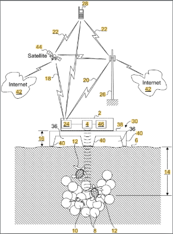
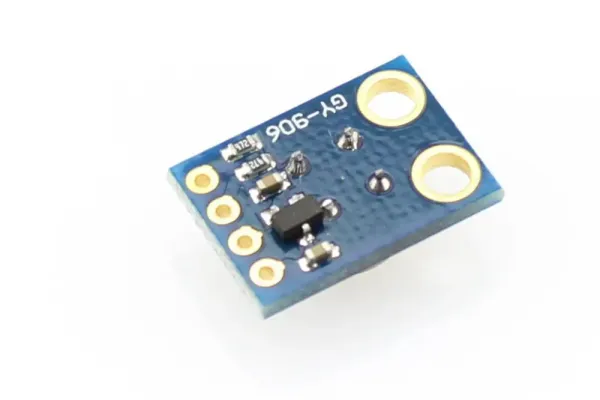
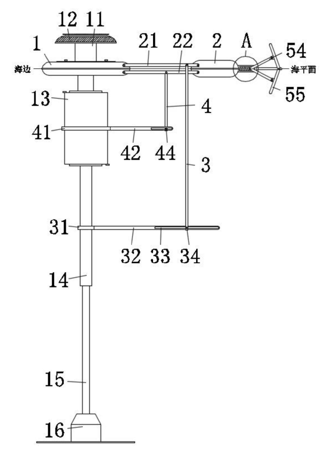
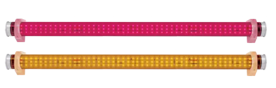
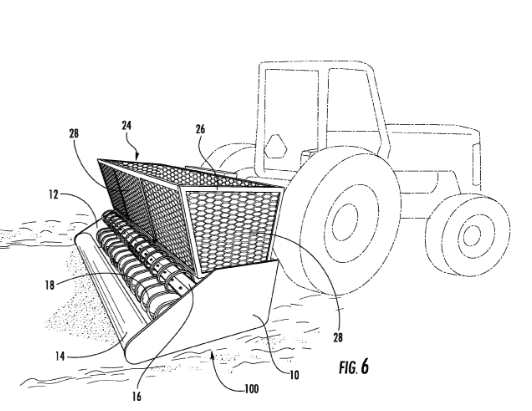

# ESTADO DEL ARTE

## EJEMPLO 1

### 1.1) Patente: US11543514B2 – *Activity detection in sand environment*

Esta patente describe un sistema no invasivo que emplea radar de impulsos de banda ultraancha (UWB-IR) para detectar actividad dentro de nidos de tortugas marinas, sin necesidad de excavar ni perturbar la arena. El radar se coloca directamente sobre la superficie del nido (arena seca o húmeda) y comienza estableciendo un nivel de potencia de referencia, es decir, una medida base del entorno sin movimiento.

A partir de ahí, el radar monitorea los cambios en la señal reflejada desde el nido. Si aparecen anomalías en la señal —es decir, variaciones significativas respecto al nivel base— el sistema las interpreta como posibles signos de actividad subterránea, como el movimiento de crías a punto de emerger. Estas anomalías se detectan cuando las variaciones superan umbrales específicos (por ejemplo, más de 3 desviaciones estándar o señales por encima de –10 decibelios), lo que garantiza mayor precisión.

Técnicamente, este radar funciona emitiendo pulsos electromagnéticos muy breves que penetran en el medio (arena) y registran los ecos de retorno. El sistema compara esos ecos en el tiempo y determina si hay movimiento biológico dentro del nido. Además, cuenta con un algoritmo que distingue entre el movimiento natural de las crías y el de posibles depredadores, para evitar falsas alarmas.  
(1)

### 1.2) Artículo Científico:  
**“Warm beach, warmer turtles: Using drone-mounted thermal infrared sensors to monitor sea turtle nesting activity”**

Durante mucho tiempo, el monitoreo de tortugas marinas ha dependido de patrullajes manuales realizados por personas durante la noche, lo cual requiere bastante esfuerzo humano. En un estudio realizado en la península de Osa, en Costa Rica, se probó por primera vez el uso de drones equipados con cámaras térmicas infrarrojas para vigilar a las tortugas marinas mientras anidan.

Los resultados demostraron que esta tecnología puede detectar tortugas, nidos, rastros e incluso crías, con una efectividad superior al patrullaje humano. El dron identificó un 20 % más de tortugas y rastros, y también detectó animales silvestres y posibles cazadores furtivos que no fueron vistos por los patrulleros.

Además, los operadores del dron lograron distinguir rastros de distintas especies de tortugas. Sin embargo, aunque el uso de drones mejora notablemente la recolección de datos y la seguridad, todavía existen retos técnicos y económicos que deben resolverse antes de que esta herramienta pueda usarse de forma estandarizada a nivel global.  
(2)

### 1.3) Producto Comercial:  
**Módulo de temperatura infrarrojo MLX90614**

En el proceso de conservación de tortugas marinas, uno de los momentos más críticos es la emergencia de las crías desde el nido hasta el mar, ya que factores como depredadores, desorientación o alteraciones térmicas pueden afectar su supervivencia. Para monitorear estos eventos sin intervenir directamente, se pueden utilizar sensores que detecten cambios de temperatura sutiles o actividad térmica en el entorno del nido.

En ese contexto, el MLX90614 es un sensor infrarrojo sin contacto que permite medir la temperatura ambiente y de objetos cercanos con alta precisión. Puede detectar variaciones térmicas asociadas a la eclosión de los huevos o el movimiento de las crías sin necesidad de excavar el nido ni colocar cámaras invasivas.  
(3)

---

## EJEMPLO 2

### 2.1) Patente: CN116398838A – *Maritime lamp beneficial for hatching and attracting sea turtles into sea*

Esta patente describe una lámpara marina automatizada diseñada para guiar a las crías de tortugas marinas hacia el mar después de eclosionar. Funciona con un sistema flotante que se posiciona sobre la superficie del agua. Debajo, contiene un generador lineal que aprovecha el movimiento de las olas para generar electricidad, la cual se almacena en una batería conectada a una lámpara LED.

La luz se activa de forma autónoma y está pensada para aprovechar el instinto natural de las tortugas recién nacidas de seguir fuentes de luz. Al colocar esta lámpara flotante en el mar (en lugar de tener luz en la playa que las desoriente), se crea un punto de atracción seguro que guía a las crías directamente hacia el océano, ayudando a reducir la mortalidad en esa etapa crítica.  
(4)

### 2.2) Artículo Científico:  
**“Seafinding revisited: how hatchling marine turtles respond to natural lighting at a nesting beach”**

Las crías de tortuga marina emergen por la noche y se guían visualmente para llegar al mar, proceso conocido como “seafinding”. Aunque se sabe que la luz influye en su orientación, no se conocía con precisión qué longitudes de onda (colores de luz) son las más efectivas. En este estudio, se midió la intensidad de la luz nocturna en distintas longitudes de onda (de 340 a 600 nm) en dos playas de anidación, y luego se evaluó en laboratorio cuál de esas luces atraía más fácilmente a crías de tortuga verde y tortuga boba.

Se descubrió que ambas especies son muy sensibles a varias longitudes de onda y responden positivamente incluso a intensidades muy bajas. Además, se confirmó que el horizonte marino refleja más luz natural que el terrestre, lo que facilita la orientación de las crías hacia el mar, aun con poca luz de luna. El estudio sugiere que esta respuesta visual podría estar mediada por células especiales (conos) que detectan mejor las luces de onda corta, ayudando así a las tortugas a orientarse en la oscuridad sin confundirse con otros estímulos visuales.  
(5)

### 2.3) Producto Comercial:  
**TurtleLite LED: Turtle-Friendly Lighting from EncapSulite**

TurtleLite LED de EncapSulite es una luminaria comercial diseñada especialmente para proteger a las tortugas marinas en zonas costeras. Emite luz ámbar de onda larga (560–600 nm), lo que reduce significativamente la desorientación de crías durante su trayecto hacia el mar.

Está construida con materiales resistentes al ambiente marino (acero inoxidable, carcasa sellada IP67) y cuenta con módulos LED duraderos que garantizan bajo consumo y larga vida útil. Su diseño ha sido certificado por la Comisión de Vida Silvestre de Florida (FWC), lo que respalda su eficacia como una solución real y comprobada para minimizar el impacto de la iluminación artificial en playas de anidación.  
(6)

---

## EJEMPLO 3

### 3.1) Patente: US9297132B2 – *Turtle friendly beach cleaning device*

Esta patente describe un dispositivo mecánico de limpieza de playas especialmente diseñado para proteger a las tortugas marinas, especialmente durante la temporada de anidación y eclosión. El sistema consiste en un conjunto de dientes curvos en forma de “S”, una barra de arrastre y una canasta de recogida. A diferencia de otros métodos de limpieza que pueden ser agresivos, este sistema ha sido desarrollado para remover residuos como algas y basura superficial sin excavar o alterar el nido.

Además, deja la arena completamente nivelada y sin huecos, lo cual es crucial para que las crías de tortugas puedan desplazarse sin obstáculos hacia el mar, aumentando sus probabilidades de supervivencia.  
(7)

### 3.2) Artículo Científico:  
**“Eco beach cleaner”**

Los desechos acumulados en las playas representan un riesgo significativo para la fauna costera, especialmente para las crías de tortugas marinas, que al emerger de sus nidos deben atravesar la arena hacia el mar. Fragmentos como vidrios, clavos o plásticos pueden causarles heridas o desviarlas de su camino.

Si bien actualmente se emplea mano de obra voluntaria o maquinaria pesada para limpiar, estos métodos pueden ser invasivos y peligrosos para los nidos, ya que remueven grandes cantidades de arena. En respuesta, el artículo propone el diseño de un robot autónomo impulsado por energía solar, capaz de recoger eficientemente residuos sin dañar el entorno. Este aparato filtra la basura de la arena superficial sin afectar zonas sensibles, lo que lo convierte en una alternativa ideal para limpiar áreas cercanas a sitios de anidación sin perturbar los nidos ni entorpecer el paso de las crías.  
(8)

### 3.3) Producto Comercial:  
**BeBot beach sweeper sifts surface sands for small debris**

BeBot es un robot eléctrico, pero también funciona con paneles solares creados para limpiar playas de su basura superficial—desde colillas y tapas hasta microplásticos y algas—sin dañar el entorno natural ni los nidos de tortuga.

Utiliza un sistema de rastrillado con púas que operan solo en los primeros 8–10 cm de arena, nivelando la superficie y dejando la playa libre de escombros, sin compactar los estratos más profundos. Esto ayuda a preservar los nidos enterrados a 30 cm de profundidad, manteniendo intacto el hábitat de eclosión y permitiendo que las crías se desplacen sin obstáculos.  
(9)

---

## REFERENCIAS BIBLIOGRÁFICAS

1. Vonderahe, R. P., Vonderahe, P. L., Schab, M. W., & Bowen, R. M. (2023). *Activity detection in sand environment* (U.S. Patent No. US11543514B2). [Disponible en Google Patents](https://patents.google.com/patent/US11543514B2/en)

2. Sellés-Ríos, B., et al. (2022). *Warm beach, warmer turtles: Using drone-mounted thermal infrared sensors to monitor sea turtle nesting activity.* Frontiers in Conservation Science, 3, 954791. [Enlace](https://www.frontiersin.org/articles/10.3389/fcosc.2022.954791/full)

3. Tesla Electronic EIRL. *Módulo de temperatura infrarrojo MLX90614*. Lima (Perú). [Enlace](https://www.teslaelectronic.com.pe/producto/modulo-de-temperatura-infrarrojo-mlx90614/)

4. Chen, C., & Guo, Y. (2023). *Maritime lamp beneficial for hatching and attracting sea turtles into sea* (CN116398838A). [Espacenet](https://worldwide.espacenet.com/patent/search/family/087010080/publication/CN116398838A)

5. Celano, L., et al. (2018). *Seafinding revisited: how hatchling marine turtles respond to natural lighting at a nesting beach*. Journal of Comparative Physiology A, 204, 1007–1015. [Springer](https://link.springer.com/article/10.1007/s00359-018-1299-4)

6. EncapSulite. *TurtleLite LED – Turtle-Friendly Lighting*. [EncapSulite](https://www.encapsulite.com/turtlelite-led-turtle-friendly-lighting-from-encapsulite-p-110392.html)

7. Thompson, R. (2016). *Turtle friendly beach cleaning device* (U.S. Patent No. US9297132B2). [Espacenet](https://worldwide.espacenet.com/patent/search/family/053181667/publication/US9297132B2)

8. Yadav, A. K., et al. (2018). *Eco beach cleaner*. IJEMR, 8(3), 1–4. [Indian Journals](https:/)
