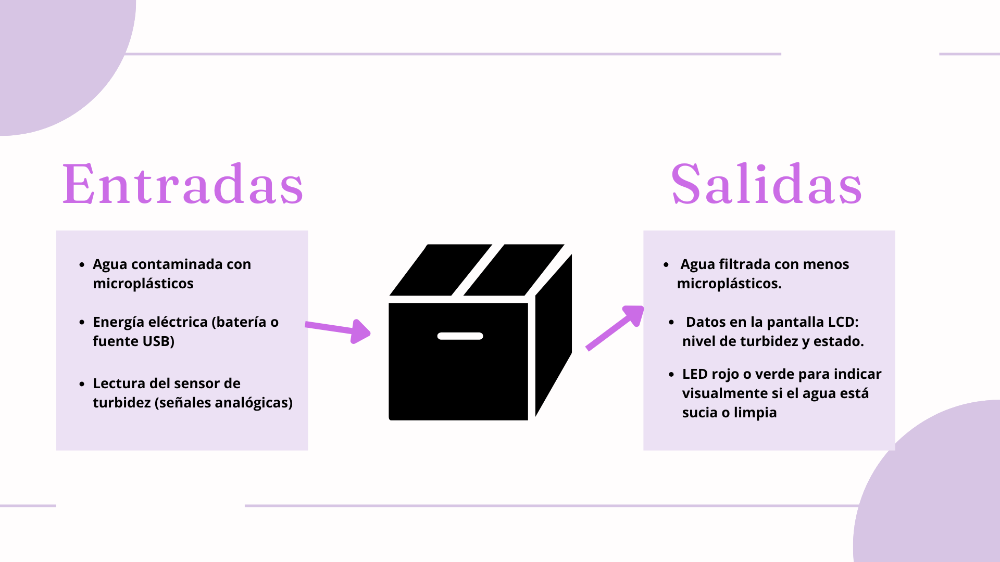
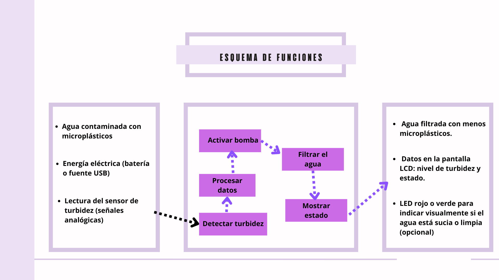

# PROPUESTA DE SOLUCIÓN
---

## 🟡 1. Introducción

La creciente contaminación por plásticos en los ecosistemas marinos del Perú es una problemática persistente que afecta la biodiversidad, la salud humana y la economía local. Aunque existen esfuerzos, como la Ley N.º 30884, para reducir la contaminación, los avances siguen siendo limitados debido a la falta de soluciones sostenibles, participación ciudadana y herramientas de evaluación para prevenir la llegada de plásticos al mar. Esto ha permitido que los residuos, especialmente los microplásticos, continúen afectando gravemente las zonas costeras y la fauna marina, poniendo en riesgo el cumplimiento de la Meta 14.1 de los Objetivos de Desarrollo Sostenible, que busca reducir la contaminación marina.

### 🔍 1.1 ¿Qué hay detrás de la situación?

Detrás de la creciente contaminación por plásticos en los ecosistemas marinos del Perú hay una combinación de factores. En primer lugar, el uso masivo e irresponsable de plásticos, especialmente los de un solo uso, por parte de la población, sin un adecuado manejo de residuos. Aunque existen leyes como la Ley N.º 30884, la falta de fiscalización y control ha permitido que muchos plásticos sigan llegando al mar. Además, la falta de educación y conciencia ambiental en gran parte de la sociedad impide que se adopten prácticas más sostenibles. Otro factor importante es la ausencia de soluciones integrales y sostenibles que aborden desde la reducción en la producción de plásticos hasta la remediación de los residuos ya existentes. También influye la débil infraestructura de reciclaje y gestión de residuos, que no es capaz de hacer frente al volumen de desechos plásticos generados, especialmente en áreas urbanas como Lima y el Callao. Todo esto contribuye a que los plásticos, particularmente los microplásticos, terminen contaminando las zonas costeras y afecten la fauna marina, poniendo en riesgo tanto la biodiversidad como la salud humana.

### 💥 1.2 Puntos de dolor identificados

Desde la perspectiva del ciudadano o usuario:

1. Poca información sobre los impactos del plástico en su entorno cercano.  
2. Desconocimiento sobre alternativas sostenibles o dónde acceder a ellas.  
3. Limitado acceso a plataformas donde puedan participar o reportar problemas ambientales.  
4. Percepción de que los esfuerzos individuales no generan impacto.  
5. Falta de datos confiables y actualizados sobre la situación ambiental local.  

---

## 🌱 2. Propuesta de solución

**PlastiClean** es un dispositivo compacto y autónomo diseñado para detectar y filtrar microplásticos presentes en el agua. Funciona mediante un sistema basado en Arduino, que utiliza un sensor de turbidez para analizar la calidad del agua y activar automáticamente una bomba que dirige el flujo hacia un filtro multicapa. Este filtro está compuesto por materiales ecológicos como malla fina, esponja de melamina y, opcionalmente, carbón activado, capaces de atrapar partículas sólidas, incluyendo microplásticos. Una pantalla LCD integrada muestra el estado del proceso en tiempo real. **PlastiClean** representa una solución práctica, educativa y replicable, ideal para sensibilizar sobre la contaminación por microplásticos, especialmente para entornos educativos o zonas vulnerables.

---

## 🎯 3. Objetivo del proyecto

### 3.1 Objetivo general:

Desarrollar un filtro autónomo e inteligente que detecte y elimine microplásticos del agua, utilizando Arduino y materiales ecológicos.

### 3.2 Objetivos específicos:

- Construir un sistema de filtración utilizando materiales reciclados y ecológicos.  
- Automatizar el proceso de filtrado mediante sensores y Arduino.  
- Medir la turbidez del agua antes y después del filtrado.  
- Promover la conciencia ambiental a través de un enfoque educativo y accesible.  

---

## 4. Caja Negra

Figura 1: Diagrama de Caja Negra del proyecto. Elaboración propia.

---

## 5. Esquema de Funciones

Figura 2: Esquema de Funciones del proyecto. Elaboración propia.

---

## 🧩6. Definición de Funciones

:small_orange_diamond: 1. Detectar turbidez (sensor)

El sensor de turbidez mide cuán clara o turbia está el agua. Si detecta que el agua tiene muchas partículas (como microplásticos), envía una señal al Arduino indicando que debe activarse el sistema de filtrado.

🔹 2. Procesar datos (Arduino)

El Arduino recibe la señal del sensor, la interpreta y toma decisiones. Por ejemplo, si el agua está turbia, ordena que se active la bomba para iniciar el filtrado. Es como el "cerebro" del sistema.

🔹 3. Activar bomba

Cuando el Arduino detecta que el agua necesita filtrarse, enciende una pequeña bomba que mueve el agua hacia el filtro. Esta bomba permite que el agua pase por el sistema.

🔹 4. Filtrar el agua (esponja/filtro)

El agua es dirigida a través de un filtro multicapa compuesto por diferentes materiales diseñados para capturar partículas sólidas de diferentes tamaños, incluidos los microplásticos. La primera capa, una malla de nylon de malla fina, atrapa las partículas más grandes. La segunda capa, una esponja de melamina, captura partículas más pequeñas debido a su estructura porosa. Si se utiliza, una capa de carbón activado adicional puede eliminar contaminantes químicos. Este proceso de filtración por capas permite una limpieza eficiente y gradual del agua, reduciendo significativamente la cantidad de microplásticos presentes en ella.

🔹 5. Mostrar estado (pantalla LCD)

La pantalla LCD muestra información útil, como “Agua limpia” o “Agua sucia”, o incluso el valor exacto de turbidez. Esto permite saber fácilmente en qué estado está el proceso.

🔹 6. Alimentar el sistema (fuente de energía)

Todo el sistema necesita energía para funcionar. Esta función se cumple con una batería, conexión USB que alimenta los sensores, el Arduino, la bomba y la pantalla.
