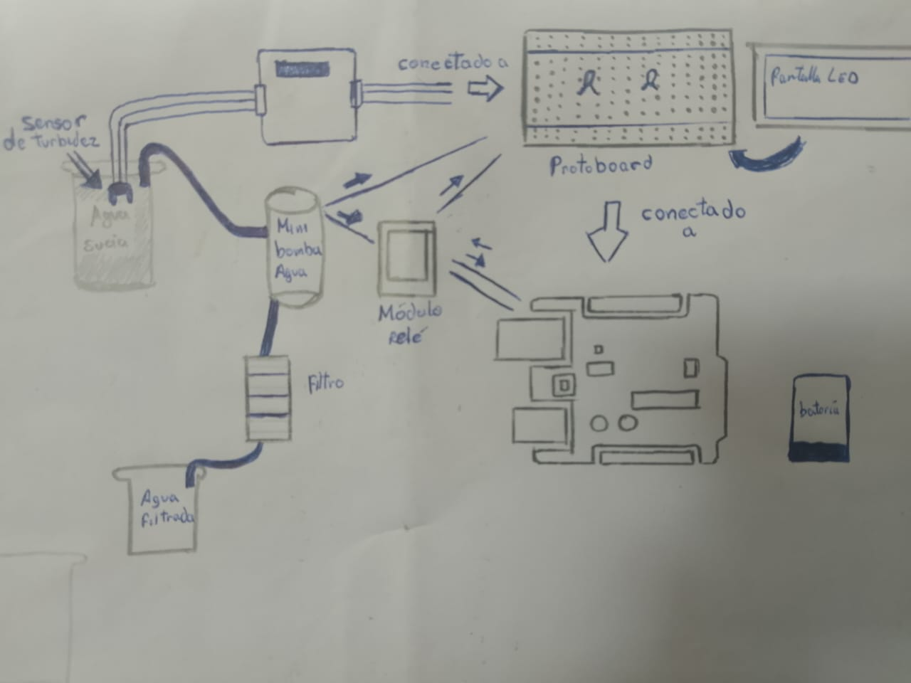

#   Boceto y Modelos 3D

### Boceto

### Protoboard

### LED verde

### LED rojo

### Módulo Relé o Transistor

### Mini Bomba de Agua 5V

### Arduino UNO 

### Sensor de Turbidez

link: https://cad.onshape.com/documents/f2299240f6fcd9cb8b918f2b/w/c7f40bedd6e02e78d723d662/e/fdb88a9daa29c95c1bfffb7c?renderMode=0&uiState=681cb7583f563009a6b6b5ce 