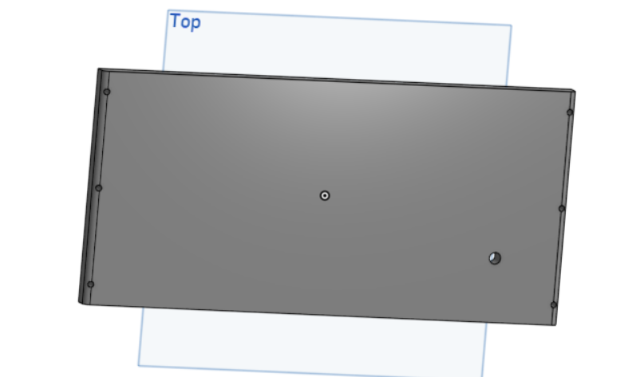
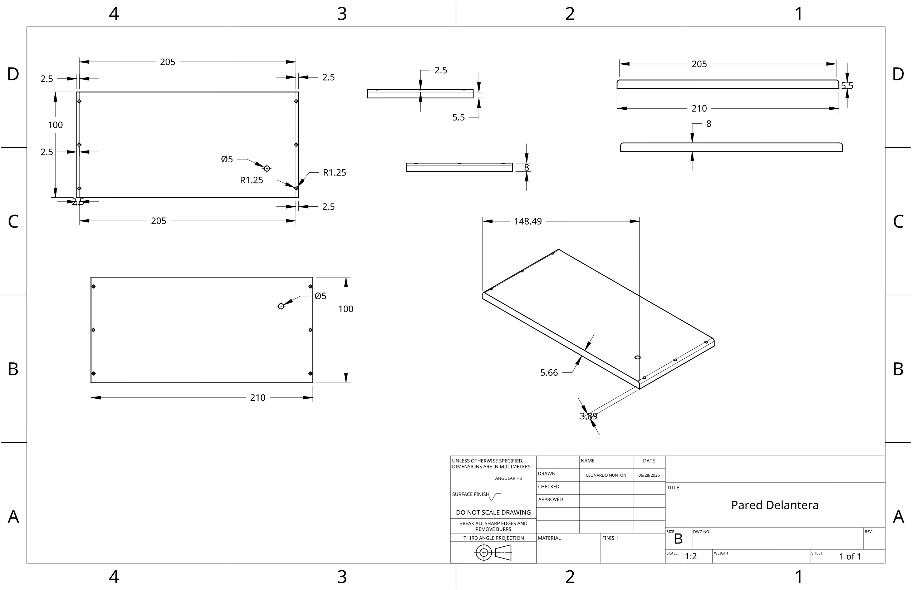
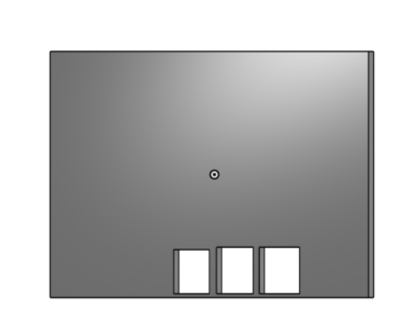
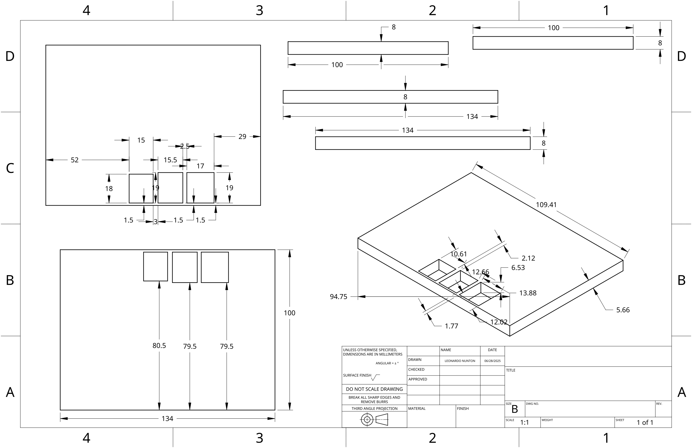
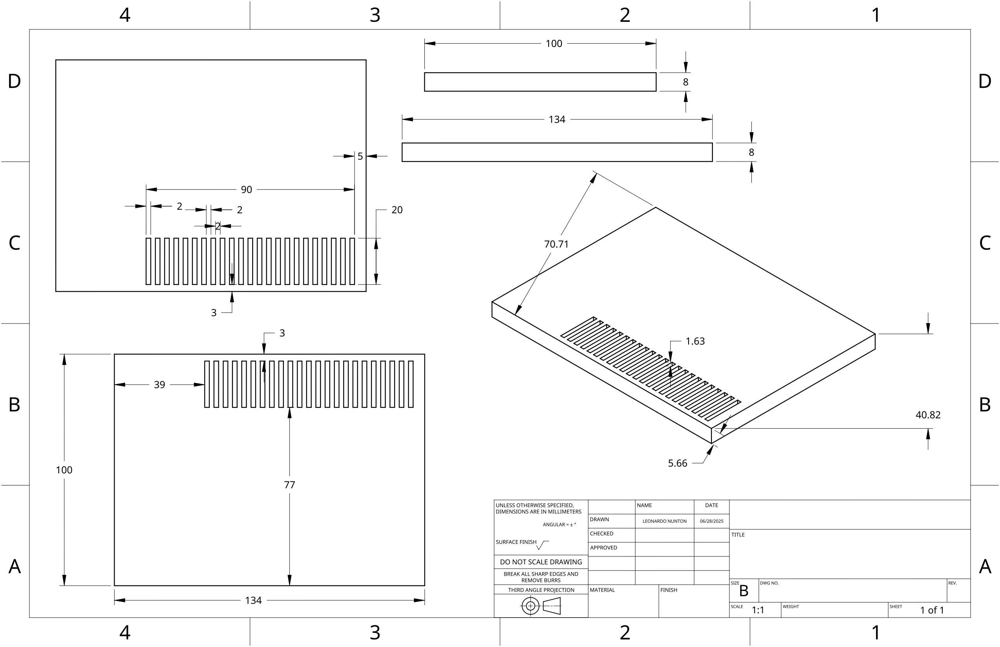
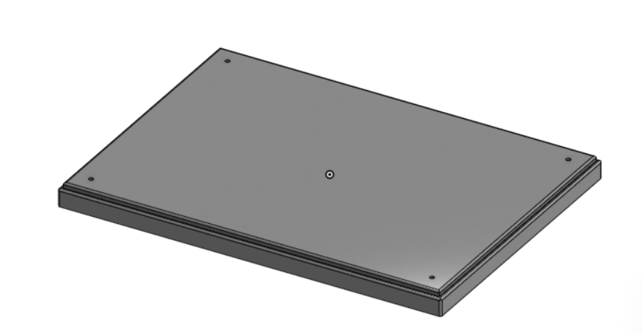
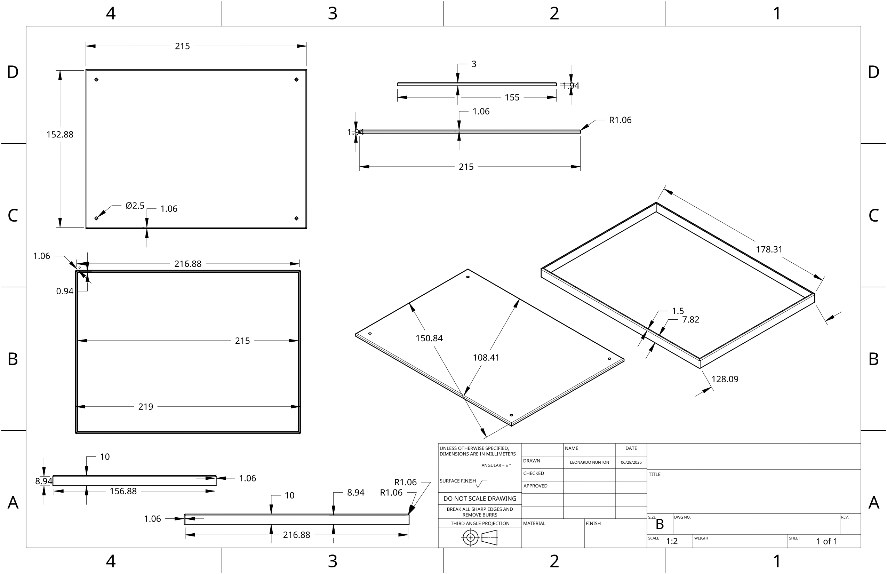
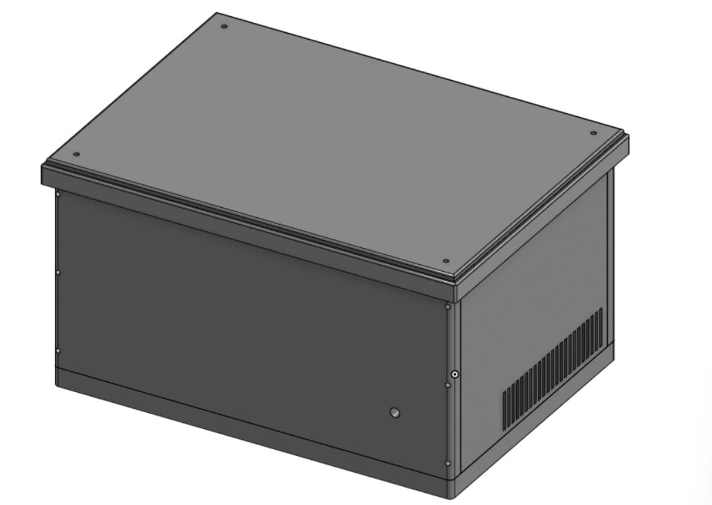
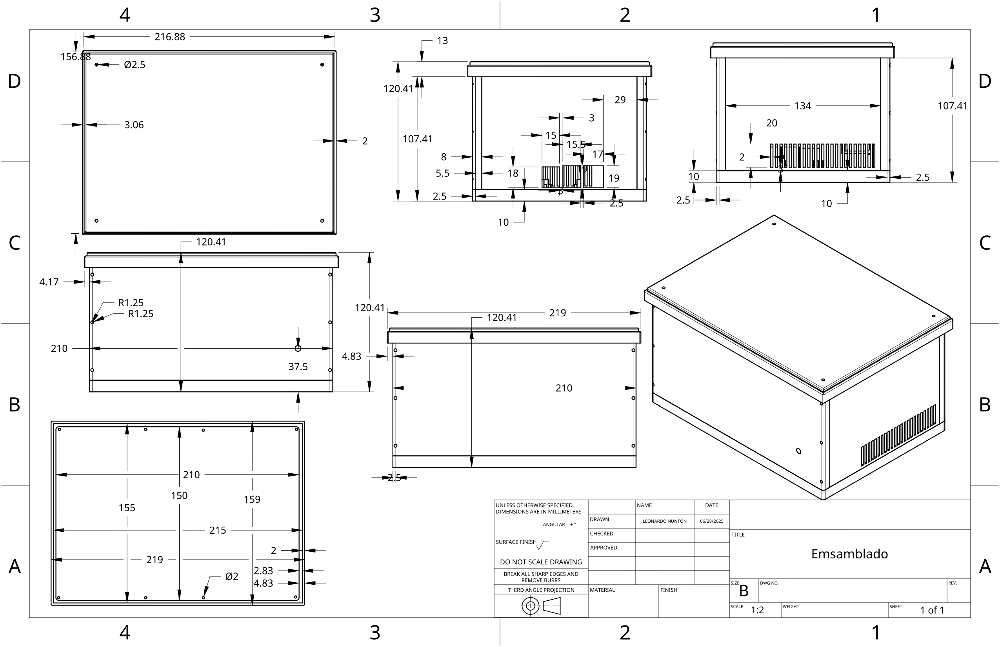

# *Planos y Modelado 3D*

## *Base*

### Modelado 3D

### Plano

## *Pared Trasera*

### Modelado 3D

### Plano

## *Pared Frontal*

### Modelado 3D

### Plano

## *Pared lateral izquierda*

### Modelado 3D

### Plano

## *Pared lateral derecha*

### Modelado 3D

### Plano

## *Tapa*

### Modelado 3D

### Plano

## *Emsamblado*

### Modelado 3D

### Plano

