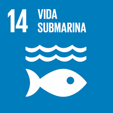

<table>
  <tr>
    <td></td>
    <td style="vertical-align: middle; padding-left: 15px;">
      <h1>UNIVERSIDAD PERUANA CAYETANO HEREDIA</h1>
    </td>
  </tr>
</table>

  
    **Curso:** Fundamentos de Diseño – Grupo 6
  

## 🤖 Sistema Recolector de Residuos Sólidos en las Playas Arenosas del Perú  
---

---

## 📘 Introducción

¡Bienvenidos al sitio oficial de nuestro proyecto!

Este trabajo fue desarrollado como parte del curso *Fundamentos de Diseño*, y se inspira en una problemática ambiental urgente: la acumulación de residuos sólidos en las playas arenosas del litoral peruano.  
Nuestro objetivo es contribuir activamente al **Objetivo de Desarrollo Sostenible (ODS) Nº 14: Vida Submarina**, ayudando a proteger los ecosistemas marinos antes de que los residuos lleguen al mar.

---

## 📑 Tabla de Contenidos
- [🌟 Misión](#misión)
- [👁️ Visión](#visión)
- [🌊 ODS 14: Vida submarina](#ods-14-vida-submarina)
- [🎯 Objetivo general del proyecto](#objetivo-general-del-proyecto)
- [✅ Objetivo específico](#objetivo-específico)
- [📌 Justificación](#justificación)
- [💡 Qué es lo que nos impulsa](#qué-es-lo-que-nos-impulsa)
- [🧑‍💻 Quiénes somos](#quiénes-somos)
- [📚 Integrantes del equipo](#integrantes-del-equipo)

---

## 🌟 Misión
Diseñar y desarrollar una solución robótica autónoma que permita recolectar residuos sólidos visibles en playas arenosas, contribuyendo a la protección de los ecosistemas marinos y reduciendo la contaminación costera mediante el uso de tecnologías accesibles y sostenibles.

---

## 👁️ Visión
Convertirnos en un referente en soluciones tecnológicas para la conservación ambiental, demostrando que la innovación puede ser alcanzable, funcional y útil para mitigar la contaminación en zonas costeras sin depender de tecnologías complejas o costosas.

---

## 🌊 ODS 14: Vida submarina

**Meta 14.1:**  
> “De aquí a 2025, prevenir y reducir significativamente la contaminación marina de todo tipo, en particular la producida por actividades realizadas en tierra, incluidos los detritos marinos y la polución por nutrientes.”

---

## 🎯 Objetivo general del proyecto
Diseñar y desarrollar un prototipo funcional de robot terrestre autónomo que recolecte residuos sólidos en playas arenosas, con el fin de prevenir que estos desechos lleguen al mar y afecten la vida marina, contribuyendo así a reducir la contaminación marina desde su origen terrestre.

---

## ✅ Objetivo específico
Reducir la presencia de residuos sólidos —especialmente plásticos y materiales de un solo uso— en zonas costeras mediante la implementación de un robot recolector, con el propósito de evitar que dichos residuos se desplacen hacia el océano y contaminen los ecosistemas marinos.

---

## 📌 Justificación
El 80 % de la contaminación marina proviene de tierra firme. La acumulación de basura en las playas del litoral peruano es una de las principales fuentes de contaminación oceánica.  
Al evitar que estos residuos lleguen al mar, este proyecto contribuye directamente a la conservación de la biodiversidad marina, al turismo sostenible y a la salud humana.

Nuestro robot busca ser una herramienta accesible, escalable y energéticamente eficiente, que fomente una gestión responsable de las playas.

---

## 💡 ¿Qué es lo que nos impulsa?
Nos mueve la preocupación por la creciente contaminación de las playas, la falta de personal constante para su limpieza y las graves consecuencias que estos residuos generan en la fauna marina y la salud humana.  
Queremos ofrecer una alternativa **autónoma y sostenible** que ayude a reducir este impacto de forma continua y eficiente.

---

## 🧑‍💻 ¿Quiénes somos?

Somos un equipo de cuatro estudiantes de la Universidad Peruana Cayetano Heredia comprometidos con la conservación del medio ambiente.  
Combinamos nuestros conocimientos en tecnología, informática y ciencias ambientales para aportar soluciones sostenibles a los problemas que afectan nuestros ecosistemas costeros.

Nuestro proyecto nace del deseo de reducir la contaminación marina desde su origen: la acumulación de residuos en playas.  
A través del desarrollo de un **robot recolector autónomo**, buscamos generar un impacto positivo en la salud de los océanos y contribuir al cumplimiento del ODS 14.1.

---

## 📚 Integrantes del equipo

- **Leonardo Javier Nunton Fajardo**  
  _Administrador del repositorio_  
  📧 leonardo.nunton@upch.pe  

- **Héctor Raúl Huarcaya Chipana**  
  _Administrador de fabricación digital_  
  📧 hector.huarcaya@upch.pe  

- **Emmy Abigail Lopez Cueva**  
  _Administradora del prototipado electrónico_  
  📧 emmy.lopez@upch.pe  

- **Angélica Sofía Pérez Poma**  
  _Administradora de redacción y fuentes bibliográficas_  
  📧 angelica.perez@upch.pe  

---
