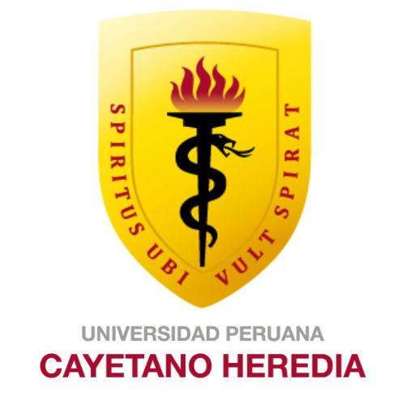
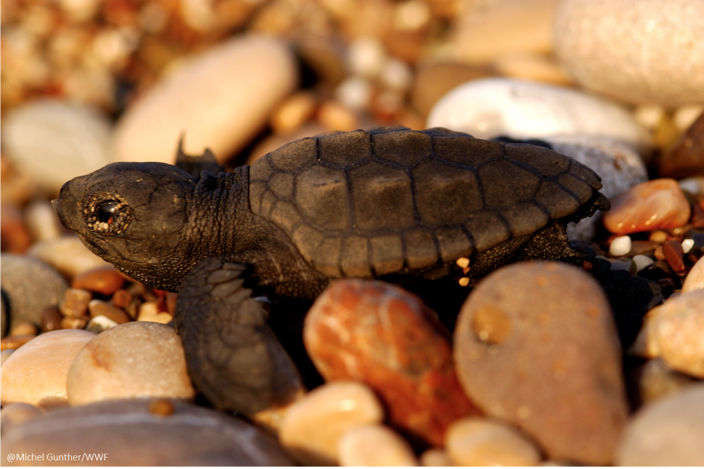

<table>
  <tr>
    <td></td>
    <td style="vertical-align: middle; padding-left: 15px;">
      <h1>UNIVERSIDAD PERUANA CAYETANO HEREDIA</h1>
    </td>
  </tr>
</table>

<h3 align="center">FUNDAMENTOS DE DISEÑO – GRUPO 6</h3>

##  🐢 Sistema de Monitoreo para la Eclosión de Tortugas Marinas

  

## 📘 Introducción

¡Bienvenidos al sitio oficial de nuestro proyecto!

Este trabajo fue desarrollado como parte del curso Fundamentos de Diseño, con el objetivo de responder a una problemática ambiental urgente: la alta mortalidad de crías de tortugas marinas en las playas del litoral norte del Perú, debido a la falta de detección oportuna de la eclosión.

Inspirados en el ODS 14: Vida Submarina, buscamos contribuir a la conservación de los ecosistemas marinos mediante una solución que permita a los cuidadores y voluntarios intervenir a tiempo durante el nacimiento de las crías, aumentando así sus probabilidades de supervivencia.

## 📑 Tabla de Contenidos
- [🌟 Misión](#misión)
- [👁️ Visión](#visión)
- [🌊 ODS 14: Vida submarina](#ods-14-vida-submarina)
- [🎯 Objetivo general del proyecto](#objetivo-general-del-proyecto)
- [✅ Objetivo específico](#objetivo-específico)
- [📌 Justificación](#justificación)
- [💡 Qué es lo que nos impulsa](#qué-es-lo-que-nos-impulsa)
- [🧑‍💻 Quiénes somos](#quiénes-somos)
- [📚 Integrantes del equipo](#integrantes-del-equipo)

## 🌟 Misión
Desarrollar una herramienta tecnológica accesible que permita detectar, de manera automatizada y oportuna, el momento de eclosión de tortugas marinas en nidos naturales, para alertar a los cuidadores responsables y facilitar una intervención inmediata.

## 👁️ Visión
Convertirnos en un referente en el uso de tecnología para la conservación de especies marinas vulnerables, demostrando que las soluciones simples pueden generar un gran impacto en la protección de la biodiversidad costera.

## 🌊 ODS 14: Vida submarina

  

**Meta 14.2:**  
> "Gestionar y proteger sosteniblemente los ecosistemas marinos y costeros para evitar efectos adversos importantes, incluso fortaleciendo su resiliencia, y adoptar medidas para restaurarlos a fin de restablecer la salud y la productividad de los océanos."

## 🎯 Objetivo general del proyecto
Diseñar un sistema automatizado de detección y alerta temprana que permita identificar el momento en que las tortugas marinas comienzan a emerger de sus nidos, facilitando una respuesta rápida por parte del personal encargado de su protección.

## ✅ Objetivo específico
Implementar una solución tecnológica basada en sensores y visión artificial que active una alerta remota cuando se detecte el nacimiento de tortugas marinas en playas de anidación del norte peruano.

## 📌 Justificación
Las crías de tortuga marina enfrentan múltiples amenazas al momento de eclosionar, como la desorientación por luz artificial, los depredadores y la interferencia humana. En muchas playas del norte del Perú, donde se ha identificado recientemente la presencia de nidos, no existen mecanismos que permitan detectar de manera oportuna este evento.

Este proyecto propone una solución tecnológica accesible que permita activar una alerta inmediata cuando ocurre una eclosión, facilitando una respuesta rápida por parte de los cuidadores. De esta forma, se busca incrementar la tasa de supervivencia de las tortugas y contribuir a los esfuerzos de conservación en zonas vulnerables.

## 💡 ¿Qué es lo que nos impulsa?
Nos motiva el deseo de proteger a una de las especies más emblemáticas y amenazadas del ecosistema marino peruano. Queremos brindar a los voluntarios de conservación una herramienta útil, fácil de usar y eficaz, que marque una diferencia real en el momento más crítico del ciclo de vida de las tortugas: su nacimiento.

## 🧑‍💻 ¿Quiénes somos?

Somos un equipo de cuatro estudiantes de la Universidad Peruana Cayetano Heredia comprometidos con la conservación del medio ambiente.  
Combinamos nuestros conocimientos en tecnología, informática y ciencias ambientales para aportar soluciones sostenibles a los problemas que afectan nuestros ecosistemas costeros.

Este proyecto nace de la reflexión sobre el impacto del ser humano en la biodiversidad marina y de la necesidad urgente de actuar.

## 📚 Integrantes del equipo

- **Frank Jauregui Bendezu** 

- **Luis Martin Valenzuela Valer**   

- **Emmy Abigail Lopez Cueva**    

- **Nathalia**   

---
